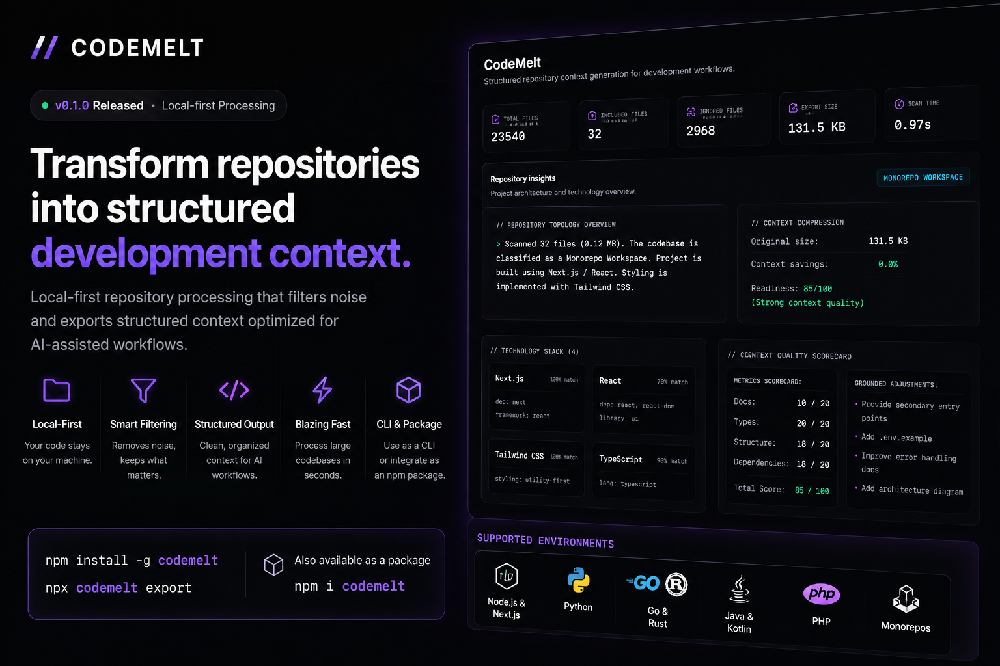
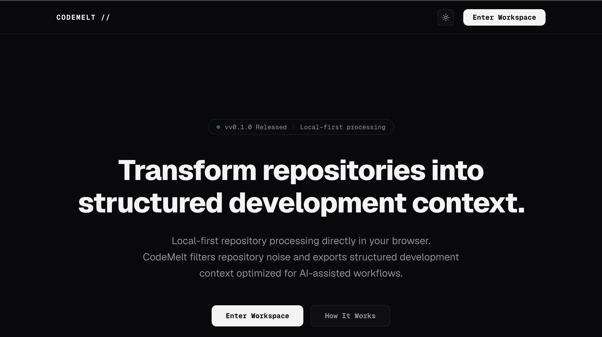
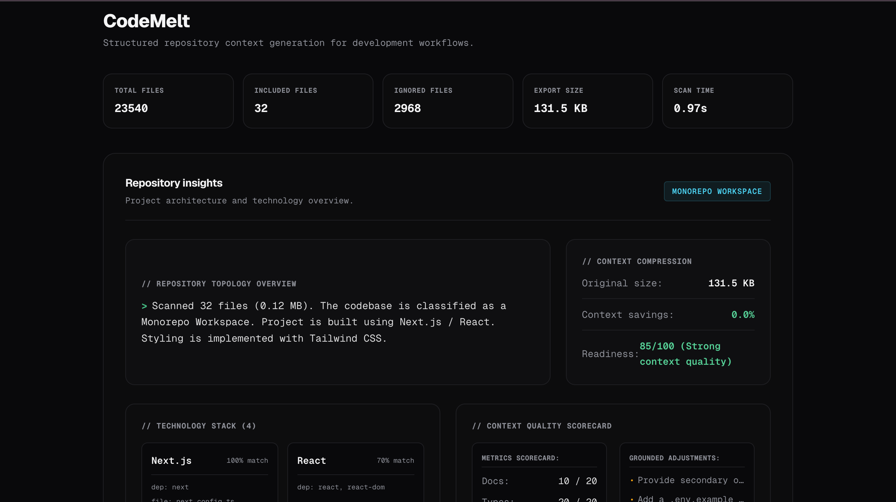
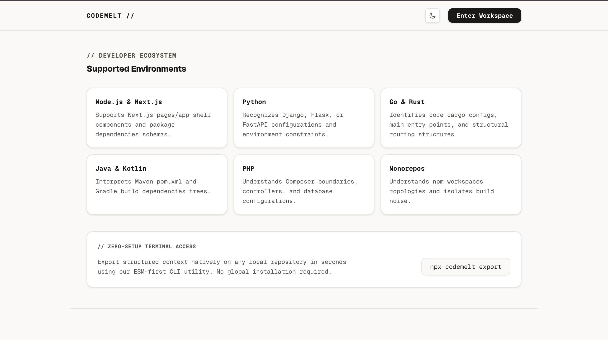

# CodeMelt



> Transform repositories into structured development context.

CodeMelt is a local-first repository intelligence engine that converts large codebases into AI-optimized development context.

Instead of manually uploading dozens of files into ChatGPT, Claude, Gemini, or Cursor, CodeMelt analyzes your repository, removes noise, extracts architectural signals, and generates structured context that AI systems can understand.

---

## The Problem

Modern AI assistants struggle with large repositories.

Developers often:

- Copy files manually into chats
- Upload folders repeatedly
- Lose architectural context
- Waste tokens on build artifacts
- Spend time explaining project structure

Large codebases become difficult for AI systems to understand efficiently.

---

## The Solution

CodeMelt automatically:

- Scans repositories
- Filters noise
- Detects technologies
- Identifies architecture
- Extracts dependency relationships
- Generates structured development context

The result is a compact, AI-ready representation of your codebase.

---

## Features

### Local-First Processing

Your code never leaves your machine.

Repositories are processed locally before export.

---

### Smart Repository Filtering

Automatically ignores:

- node_modules
- dist
- build
- coverage
- cache directories
- generated files

Only meaningful source context is retained.

---

### Repository Intelligence

Generate insights including:

- Project topology
- Framework detection
- Dependency analysis
- Technology stack discovery
- Architecture overview
- Monorepo detection

---

### AI-Optimized Context Export

Exports structured context designed for:

- ChatGPT
- Claude
- Gemini
- Cursor
- Windsurf
- Copilot
- Custom AI workflows

---

### Multi-Language Support

Supports analysis of:

- Node.js
- Next.js
- React
- TypeScript
- Python
- Go
- Rust
- Java
- Kotlin
- PHP
- Monorepos

---

### Fast Processing

Large repositories can be analyzed in seconds.

---

## Screenshots

### Landing Experience



Modern local-first workflow designed specifically for AI-assisted development.

---

### Repository Upload Workspace



Upload repositories directly from your browser and generate structured development context without additional setup.

---

### Repository Intelligence Report



Deep repository analysis including architecture insights, technology detection, context quality scoring, and AI readiness metrics.

---

## How It Works

```text
Repository
     │
     ▼
Repository Scanner
     │
     ▼
Noise Filtering
     │
     ▼
Technology Detection
     │
     ▼
Architecture Analysis
     │
     ▼
Context Compression
     │
     ▼
AI-Optimized Export
```

---

## Supported Ecosystems

### Frontend

- React
- Next.js
- TypeScript
- JavaScript

### Backend

- Node.js
- Express
- FastAPI
- Django
- Flask

### Systems

- Go
- Rust

### Enterprise

- Java
- Kotlin
- PHP

### Monorepos

- npm workspaces
- Turborepo
- multi-package repositories

---

## Example Use Cases

### ChatGPT Context Export

Convert a large repository into a compact context file before asking:

```text
Analyze this authentication flow.
```

---

### AI Code Reviews

Generate architectural summaries for:

```text
Review this codebase and identify risks.
```

---

### Repository Onboarding

Help new developers understand:

- Project structure
- Technologies
- Key dependencies
- Architecture patterns

---

### Documentation Generation

Generate AI-ready context for:

- README creation
- Architecture diagrams
- Technical documentation

---

## Installation

### Global Install

```bash
npm install -g codemelt
```

### Run

```bash
npx codemelt export
```

---

## Why CodeMelt?

Most repository tools focus on:

- search
- indexing
- code navigation

CodeMelt focuses on something different:

> Preparing repositories for AI.

It bridges the gap between large codebases and modern AI workflows.

---

## Roadmap

- Dependency graph visualization
- Repository diagrams
- Architecture maps
- AI context quality improvements
- Team workspaces
- Context versioning
- Incremental repository exports
- VS Code extension

---

## Built For

- Software Engineers
- AI Engineers
- Open Source Maintainers
- Technical Writers
- Engineering Teams
- Developer Tool Builders

---

## License

MIT